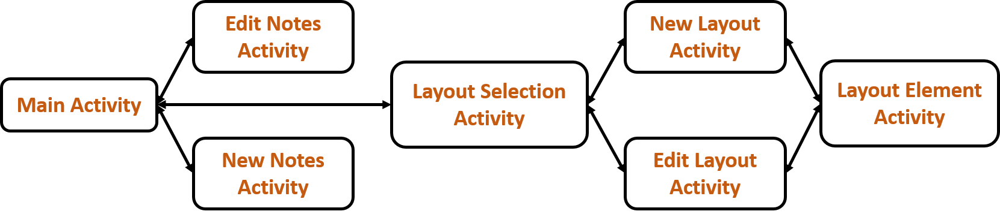

# UDefine

## UDefine Activity Architecture

## list of tools, libraries, platform, etc.
- RoomDatabase
- ArrayAdapter
- DialogFragment
  - TimePicker
  - DatePicker
- LayoutInflater  

## contributions of each team member
- Idea
  - Layout Design: 紹華,京樺,珈珈,希炫
  - Process Design: 紹華,京樺
  - Database Schema Design: 珈珈,希炫
- Implement
  - Main Process: 紹華,京樺
  - Database API: 珈珈,希炫

## Author
* [Dr. Wang](https://github.com/oiz5201618) (王紹華P76064677)
* [Vivian Lin](https://github.com/jkrvivian) (林京樺P)
* [PlusPlus Liu](https://github.com/joy45689) (劉珈珈P76074135)
* [Fan of Han](https://github.com/wsp50317) (吳希炫P76071292)
