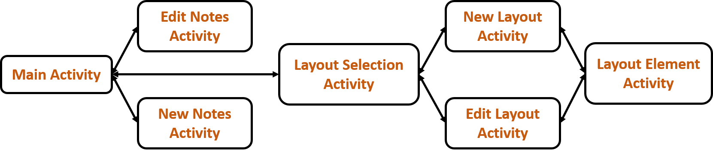

# UDefine

## APK Download Link
[Udefine_apk](https://drive.google.com/file/d/1ReuHhpVZESJsZEiAc6TaxDR8lUklckeS/view?usp=sharing)

## Project Report slides
[Udefine](https://drive.google.com/file/d/1cF81NqU1XE1W0vww78XrOPkSrwPwNm3R/view?usp=sharing)

## UDefine Activity Architecture

## list of tools, libraries, platform, etc.
- RoomDatabase
  - ViewModel
  - Repository
  - DAO
  - AsyncTask
- RecyclerView
- ArrayAdapter
  - LiveData
- DialogFragment
  - TimePicker
  - DatePicker
- LayoutInflater  
- SharedPreference

## contributions of each team member
- Idea
  - Layout Design: 紹華,京樺,珈珈,希炫
  - Control Flow Design: 紹華,京樺
  - Database Schema Design: 珈珈,希炫
- Implementation
  - Main Process: 紹華,京樺
  - Database API: 珈珈,希炫

## Author
* [Dr. Wang](https://github.com/oiz5201618) (王紹華P76064677)
* [Vivian Lin](https://github.com/jkrvivian) (林京樺P76074591)
* [PlusPlus Liu](https://github.com/joy45689) (劉珈珈P76074135)
* [Fan of Han](https://github.com/wsp50317) (吳希炫P76071292)
